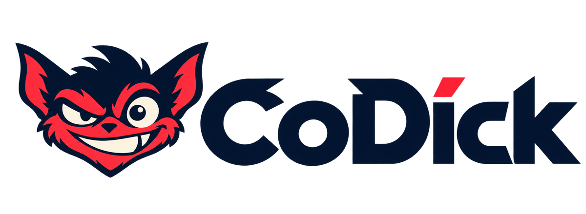
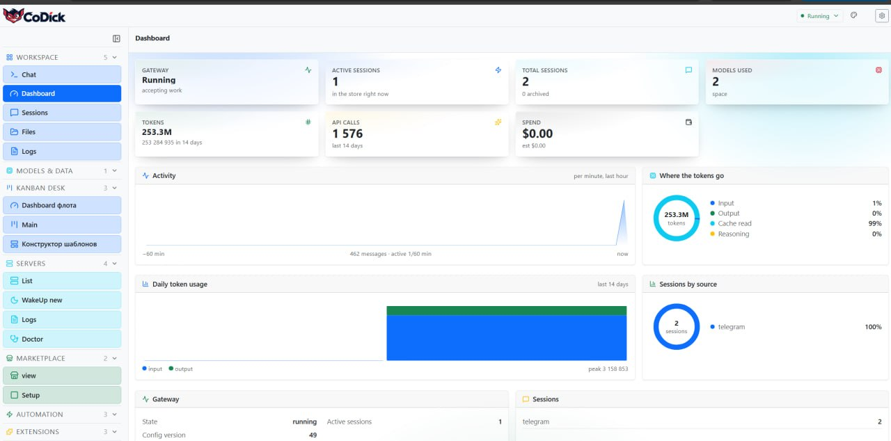
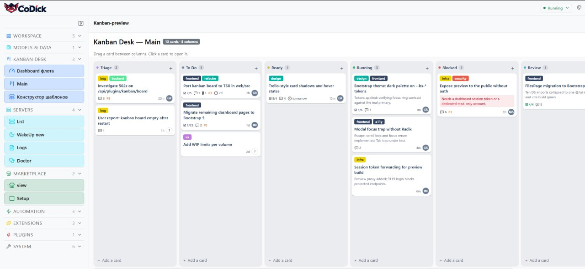
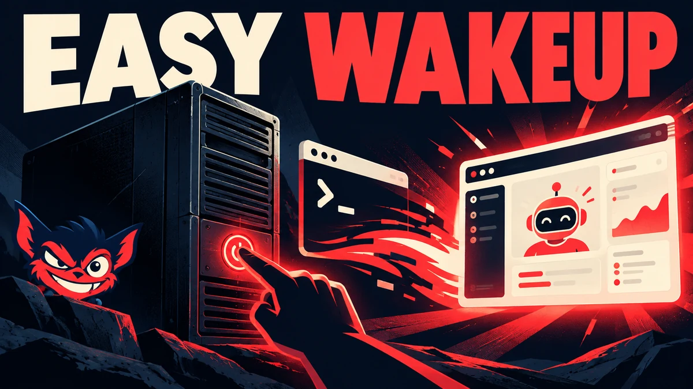
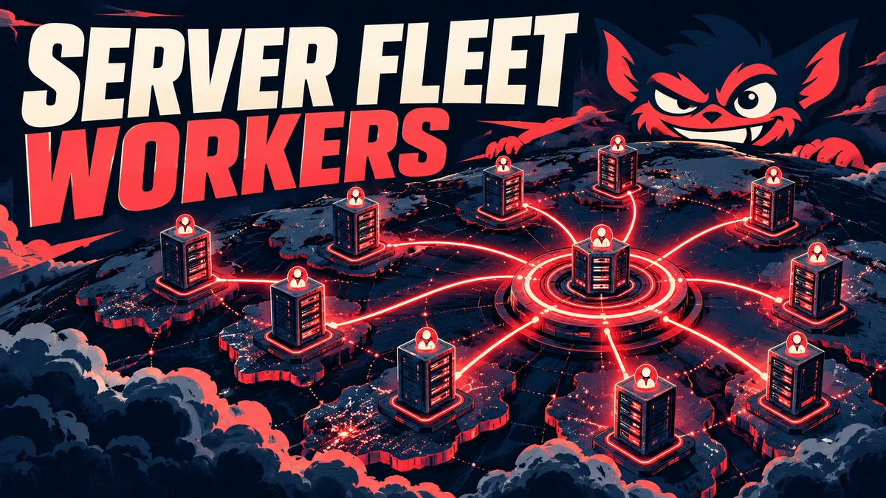
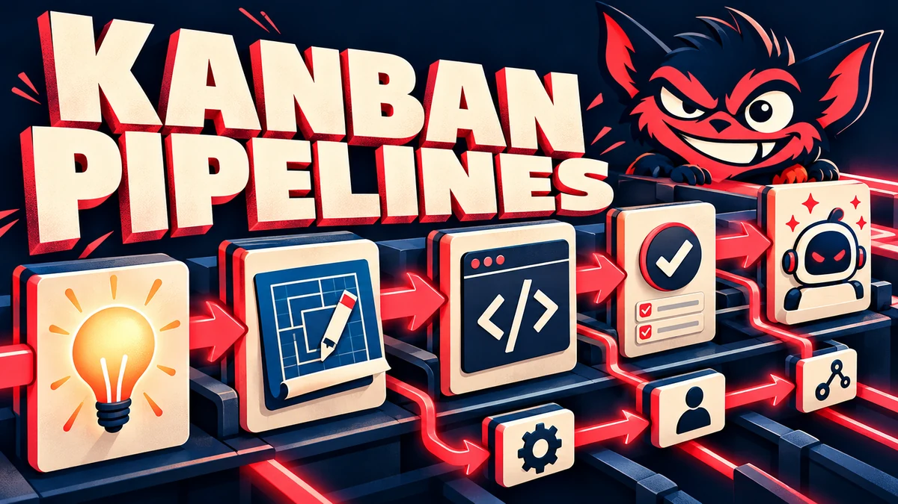
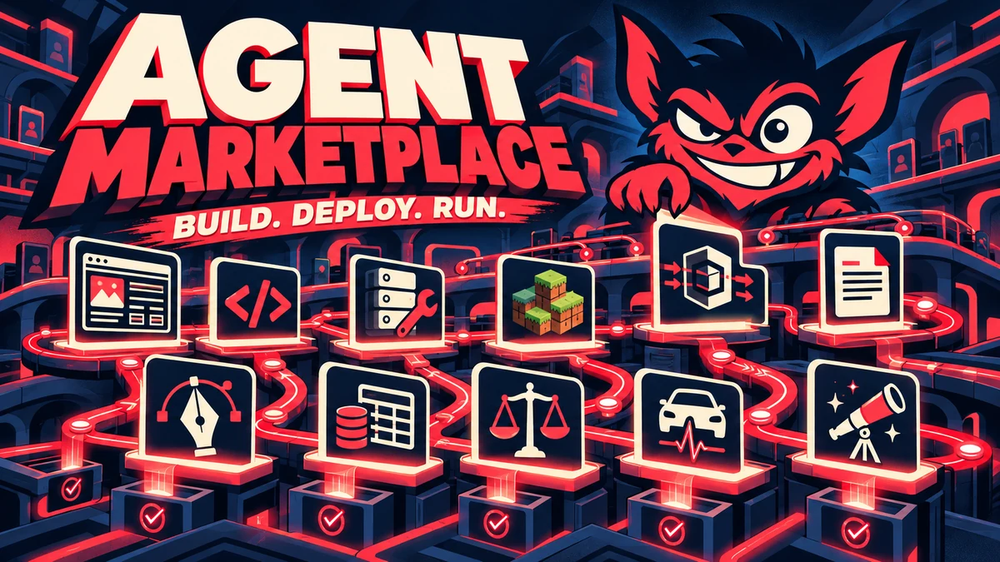

<p align="center">
  
</p>

<h1 align="center">CoDick</h1>

<p align="center"><strong>Wake servers. Command workers. Deploy workflows.</strong></p>

<p align="center">
  An independent, community-built interface for <a href="https://github.com/NousResearch/hermes-agent">Hermes Agent</a>.
  Today: a Bootstrap-powered dashboard. Next: a server fleet, visual pipelines, and an open marketplace of deployable agent workflows.
</p>

<p align="center">
  <a href="#what-works-today">What works</a> ·
  <a href="#the-roadmap">Roadmap</a> ·
  <a href="#agent-marketplace-preview">Marketplace preview</a> ·
  <a href="#join-the-build">Join the build</a>
</p>

<p align="center">
  <a href="LICENSE"></a>
  <a href="#what-works-today"></a>
  <a href="#the-roadmap"></a>
</p>

> **Independent project.** CoDick is built on Hermes Agent by Nous Research. It is not an official Nous Research product and is not affiliated with, endorsed by, or supported by Nous Research. The upstream MIT license and its copyright notice are retained. See [Credits and license](#credits-and-license).

## What works today

**The dashboard** — gateway and session state, live token usage and spend, and charts drawn from the APIs that already exist rather than from fixtures.



**The Kanban desk** — a Trello-style board: fixed columns on a scrolling rail, cards as the only elevated surface, drag between columns, and real Trello's label palette.



**The web dashboard has been migrated to Bootstrap 5.3.** This is the current implemented scope of CoDick. The existing Hermes agent, gateway, CLI, tools, and execution model remain upstream. Fleet enrollment, one-click server setup, the workflow builder, and the marketplace described below are **planned**, not shipped features.

The rail is already sectioned for where those go: **Kanban Desk**, **Servers** and **Marketplace** are in place, and the routes behind them are live but empty. The dashboard work includes a rebuilt navigation shell, Bootstrap-based components and color modes, an overview of gateway and session activity, and SVG charts backed by existing Hermes APIs. The UI is developed in `web/`; the Python backend serves its built assets from `hermes_cli/web_dist`.

This repository is where that work lands. The public fork that carries its full commit history remains at [martinroot/hermes-multiserver-web-bootstrap](https://github.com/martinroot/hermes-multiserver-web-bootstrap). Expect changes while the interface settles.

## The roadmap

The intended path is deliberately simple for the user: **connect a server → wake it → assemble a workflow → watch agents work**.

| Stage | Status | Intended experience |
| --- | --- | --- |
| Bootstrap dashboard | **Available now** | A clearer web surface for managing a Hermes installation. |
| Easy WakeUP | **Planned** | Add a server, establish SSH access, set up the runtime, and bring the node online from a guided flow. |
| Server Fleet & Workers | **Planned** | See multiple servers, their agents, health, capacity, and activity in one place. |
| Kanban Pipelines | **Planned** | Build reusable multi-step workflows with dependencies, reviews, retries, artifacts, and human checkpoints. |
| Agent Marketplace | **Exploration** | Discover, inspect, install, run, and eventually publish portable agent workflows. |

These are product directions, not release dates or commitments. Each stage needs a working end-to-end demo before it is marked available.

### Easy WakeUP



The goal: turn a clean server into a connected Hermes worker through a guided flow. SSH is the enrollment path; the long-running fleet connection and credentials model still need design and implementation. The first demo should prove the whole journey from a fresh machine to a visible, healthy node.

### Server Fleet & Workers



One operator view across machines: which nodes are online, which profiles and workers they host, what each worker is doing, and where intervention is needed. A fleet view is useful only when actions and results are actually tied to the correct server.

### Kanban Pipelines



The ambition is a Trello-like visual layer for serious agent work: stages, assignees, dependencies, review loops, execution history, and deliverables. Hermes already has a [Kanban task model](https://hermes-agent.nousresearch.com/docs/user-guide/features/kanban); CoDick aims to make complex workflows easier to assemble and operate, including across a future fleet.

## Agent marketplace preview



**Don't hire a chatbot. Deploy a workflow.**

The marketplace idea is to share *reproducible outcomes*: the required inputs and access, the steps and agent roles, the models and tools, the approval points, and the artifacts a user should receive. A listing should tell you what it does, what it may change, and what it takes to run. Marketplace installation, publishing, payments, and the listings below are **concepts**, not current product capabilities.

| Build & ship | Servers & operations | Creative & documents | Business & research |
| --- | --- | --- | --- |
| Web Agency | Nginx WakeUP | PDF Surgeon | Research Desk |
| Landing Page Sprint | Minecraft over SSH | Brand Designer | Data Parser |
| UI Redesign | VPN Backend | Product Card Studio | Bookkeeping Assistant |
| Code Reviewer | Docker Deploy | SEO Workshop | Contract Reviewer |
| Bug Hunter | Server Doctor | Video Editor | Legal Draft Assistant |
| API Builder | Backup Guardian | Audio to Text | Auto Diagnostic Guide |
| Test Engineer | Migration Crew | Image Editor | Customer Concierge |
| Release Captain | Uptime Watcher | Translation Desk | CRM Cleanup |

**Example: Web Agency** could move from brief and review to design, frontend, backend, QA, and delivery, with a person approving key handoffs. **Minecraft over SSH** could gather server requirements, provision a host, install and configure the game server, run checks, and hand back access and operational notes. These are proposed workflows; the contracts and tests still need to be built.

For legal, accounting, and vehicle diagnostics, the intended role is to organize evidence and prepare drafts or checks for qualified human review, not to make final professional decisions on a user's behalf.

## Build from source

This is a fork of Hermes Agent, not a separate agent runtime. Follow the [upstream development setup](https://hermes-agent.nousresearch.com/docs/developer-guide/contributing) to prepare a working checkout. In that checkout, the web workspace can be built with:

```bash
npm install --workspace web
npm run build --workspace web
```

Then launch `hermes dashboard` from the configured development installation. The [upstream installer](https://hermes-agent.nousresearch.com/docs/getting-started/installation) installs upstream Hermes; running it alone does **not** install CoDick's dashboard changes.

```
web/            React, Vite, Bootstrap dashboard
hermes_cli/     Hermes Python package and web backend
apps/           upstream desktop application
plugins/        upstream bundled plugins
```

## Join the build

Star or watch this repository to follow progress. If you run Hermes on more than one server, share the workflow that hurts most today. Real deployment stories will shape the first fleet demo.

Contributions are welcome: dashboard polish, accessibility, onboarding design, fleet protocols, workflow definitions, documentation, and reproducible test cases. Open an [issue](https://github.com/martinroot/codick/issues) with a focused proposal or a small pull request. Please distinguish implemented behavior from roadmap ideas in contributions and screenshots.

The first milestone worth celebrating is concrete: **fresh server → guided enrollment → visible worker → assigned task → observable result**.

## Credits and license

This project was born out of the generosity of [OpenRouter](https://openrouter.ai/stealth/space-bunny-alpha). The work behind it — a large UI migration, done commit by commit — ran on `stealth/space-bunny-alpha` with the unlimited tokens of the Boost skill day programme. Were that the norm rather than the occasion, the open-source market would move a good deal faster.

[Hermes Agent](https://github.com/NousResearch/hermes-agent) is developed by [Nous Research](https://nousresearch.com). Its CLI, gateway, agent tools, and core runtime are the upstream project's work. CoDick's current contribution is the Bootstrap web dashboard; its future fleet and marketplace ideas are independent plans.

The original [MIT license](LICENSE), including `Copyright (c) 2025 Nous Research`, is retained. CoDick modifications are the work of this repository's contributors.
